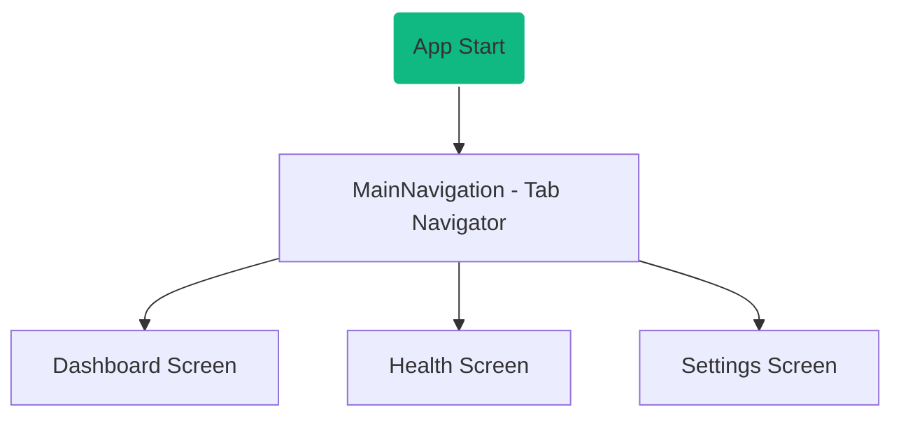

# ChargeGuardRN

**A smart battery monitoring and health management application built with React Native.**

ChargeGuardRN is a mobile application designed to provide users with detailed insights into their device's battery status, health, and charging patterns. It leverages a custom native module to fetch real-time data, presenting it in a clean, intuitive, and visually appealing interface.

---

## ✨ Core Features

-   **Real-time Dashboard**: Monitor live charging status, power (in Watts), device temperature, and estimated time to full charge (ETA).
-   **Dynamic Graphs**: Visualize temperature and power history over the last 5 minutes to identify trends.
-   **Comprehensive Health Overview**: Get a clear battery health score (out of 10), see estimated battery duration for normal and power-saving modes, and view key metrics like charge cycles and design capacity.
-   **Optimization Tips**: Receive actionable recommendations to improve charging habits and extend battery lifespan.
-   **Unified Dark Theme**: A sleek, modern "glassmorphism" design is used across all screens for a consistent user experience.
-   **Native Integration**: A custom Android/iOS native module (`ChargerStats`) provides accurate, low-level battery information directly from the operating system.

## 🛠️ Technology Stack

-   **Framework**: React Native
-   **Language**: TypeScript
-   **Navigation**: React Navigation
-   **Styling**: React Native StyleSheet with a custom theme object.
-   **UI Components**: Custom-built components including `GlassCard`, `BatteryCircle`, and `MetricGraph`.
-   **Native Modules**: Custom native module for Android & iOS to access deep battery stats.

## 🏛️ Architecture and Data Flow

The application follows a component-based architecture with a clear separation of concerns between screens, components, and services (like Context and Native Modules).

### Data Flow Diagram

Data originates from the native device hardware, is processed by our custom `ChargerStats` module, and flows through the React Native bridge to the UI components.

```mermaid
graph TD
    subgraph Native Layer
        A[Device Hardware] --> B{ChargerStats Native Module};
    end

    subgraph React Native Bridge
        B -- Emits Events --> C[NativeEventEmitter];
    end

    subgraph React Native App
        C --> D[DashboardScreen];
        C --> E[BatteryContext];

        D --> D1[ChargeCard];
        D --> D2[MetricCard];
        D --> D3[MetricGraph];

        E --> F[HealthScreen];
        F --> F1[BatteryCircle];
        F --> F2[Health Metrics];
    end

    style A fill:#333,stroke:#fff,stroke-width:2px
    style B fill:#555,stroke:#fff,stroke-width:2px
    style C fill:#282c34,stroke:#61dafb,stroke-width:2px
    style D fill:#282c34,stroke:#61dafb,stroke-width:2px
    style E fill:#282c34,stroke:#61dafb,stroke-width:2px
```



### Navigation Flow

The app uses a bottom tab navigator as its primary navigation structure.



## 📁 Project Structure

The project source code is organized into logical directories:

```
src
├── components/    # Reusable UI components (GlassCard, ChargeCard, etc.)
├── context/       # React Context providers (BatteryContext)
├── navigation/    # Navigation logic and stack/tab definitions
├── screens/       # Top-level screen components (Dashboard, Health, Settings)
├── theme/         # Global theme settings (colors, typography, spacing)
└── App.tsx        # Root component of the application
```

# Getting Started

> **Note**: Make sure you have completed the [Set Up Your Environment](https://reactnative.dev/docs/set-up-your-environment) guide before proceeding.

## Step 1: Start the Metro Server

First, you will need to run **Metro**, the JavaScript build tool for React Native.

To start the Metro dev server, run the following command from the root of your React Native project:

```sh
# Using npm
npm start

# OR using Yarn
yarn start
```

## Step 2: Build and run your app

With Metro running, open a new terminal window/pane from the root of your React Native project, and use one of the following commands to build and run your Android or iOS app:

### Android

```sh
# Using npm
npm run android

# OR using Yarn
yarn android
```

### iOS

For iOS, remember to install CocoaPods dependencies (this only needs to be run on first clone or after updating native deps).

The first time you create a new project, run the Ruby bundler to install CocoaPods itself:

```sh
bundle install
```

Then, and every time you update your native dependencies, run:

```sh
bundle exec pod install
```

For more information, please visit [CocoaPods Getting Started guide](https://guides.cocoapods.org/using/getting-started.html).

```sh
# Using npm
npm run ios

# OR using Yarn
yarn ios
```

If everything is set up correctly, you should see your new app running in the Android Emulator, iOS Simulator, or your connected device.

This is one way to run your app — you can also build it directly from Android Studio or Xcode.

## Step 3: Modify your app

Now that you have successfully run the app, let's make changes!

Open `App.tsx` in your text editor of choice and make some changes. When you save, your app will automatically update and reflect these changes — this is powered by [Fast Refresh](https://reactnative.dev/docs/fast-refresh).

When you want to forcefully reload, for example to reset the state of your app, you can perform a full reload:

- **Android**: Press the <kbd>R</kbd> key twice or select **"Reload"** from the **Dev Menu**, accessed via <kbd>Ctrl</kbd> + <kbd>M</kbd> (Windows/Linux) or <kbd>Cmd ⌘</kbd> + <kbd>M</kbd> (macOS).
- **iOS**: Press <kbd>R</kbd> in iOS Simulator.

## Congratulations! :tada:

You've successfully run and modified your React Native App. :partying_face:

### Now what?

- If you want to add this new React Native code to an existing application, check out the [Integration guide](https://reactnative.dev/docs/integration-with-existing-apps).
- If you're curious to learn more about React Native, check out the [docs](https://reactnative.dev/docs/getting-started).

# Troubleshooting

If you're having issues getting the above steps to work, see the [Troubleshooting](https://reactnative.dev/docs/troubleshooting) page.

# Learn More

To learn more about React Native, take a look at the following resources:

- [React Native Website](https://reactnative.dev) - learn more about React Native.
- [Getting Started](https://reactnative.dev/docs/environment-setup) - an **overview** of React Native and how setup your environment.
- [Learn the Basics](https://reactnative.dev/docs/getting-started) - a **guided tour** of the React Native **basics**.
- [Blog](https://reactnative.dev/blog) - read the latest official React Native **Blog** posts.
- [`@facebook/react-native`](https://github.com/facebook/react-native) - the Open Source; GitHub **repository** for React Native.
# ChargeGuardRNApp
